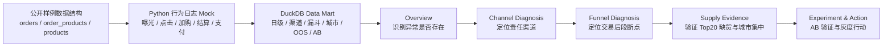

# SwiftCart 项目流程图

## 汇报主线

1. 先证明异常存在：首单支付率与 D1 留存同步下探。
2. 再排除流量规模问题：新用户规模未同步断崖。
3. 然后定位责任渠道：信息流渠道A表现最差。
4. 继续定位漏斗断点：结算到支付下滑最明显。
5. 最后验证候选原因：Top20 缺货、北京/杭州、缺货反馈共同支持供给短缺解释。
6. 用 AB 实验闭环：智能替代品推荐 + 补偿券对首单支付率有正向改善。

